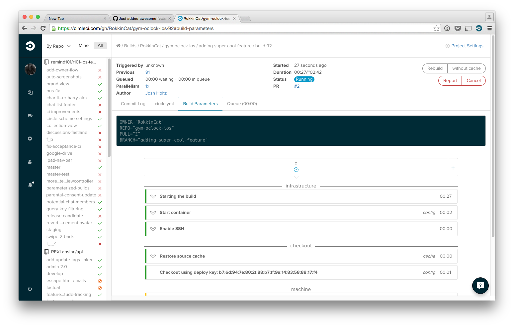
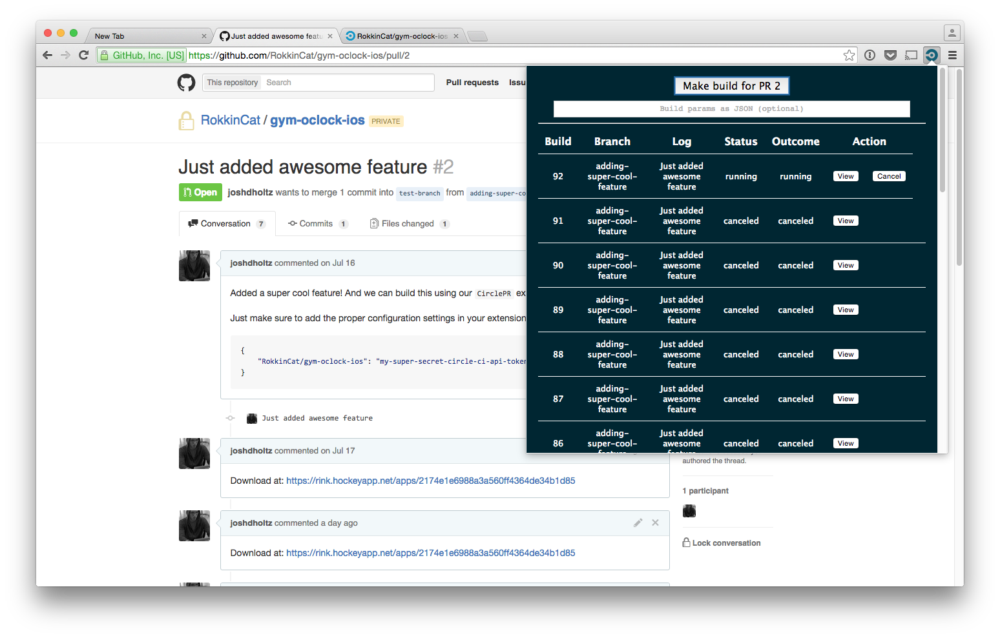
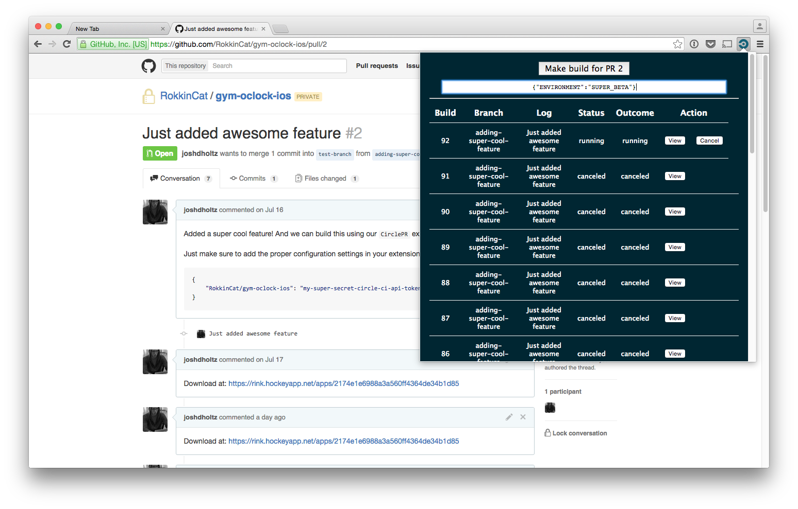
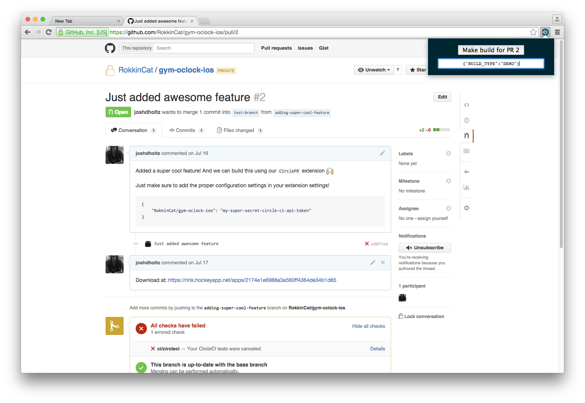
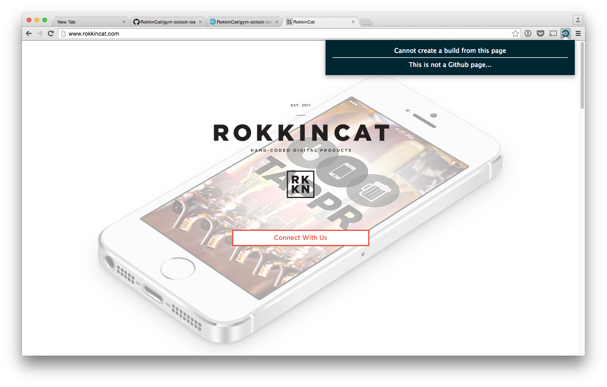

#  CirclePR
`CirclePR` is an unofficial Chrome Extension for CircleCI (https://circleci.com/). It sends a parameterized build to your CircleCI project from the push of a button while viewing your Pull Request on Github.

[Get it on the Chrome Web Store :fist:](https://chrome.google.com/webstore/detail/circlepr-for-circleci/hcinmdnhmbfnfaaodeehiipiaekdkjhj)

## Example Usage
Use the extension to kick off a build of a new feature for an iOS app to CircleCI. CircleCI builds the iOS project using Fastlane and then sends the new build to HockeyApp for your client, stakeholders, or QA team to test.

## Setup

All you need to do is to make sure that you set the correct configurations in your plugin :blush: The configuration is a simple JSON object where the key are in the format of "owner/repo" and the values are the CircleCI API tokens.

```json
{ "RokkinCat/gym-oclock-ios": "my-super-secret-token" }
```

## The Process
Your build is only a few simple steps away :raised_hands:

### Step 1 - Navigate to Github Pull Request


### Step 2 - Click the CirclePR button


### Step 3 - Click the "Make build for PR #" button
A new tab will open for the CircleCI build that was started


### Step 4 - Admire it


## Using Custom Build parameters (Optional)
Sometimes you may want to send up custom build parameters to build for a different environment (or whatever else you may dream up). `CirclePR` makes this pretty painless (except for the writing of a JSON string :wink:)

### Enter build parameters as a JSON string


### View build parameters in CircleCI build

